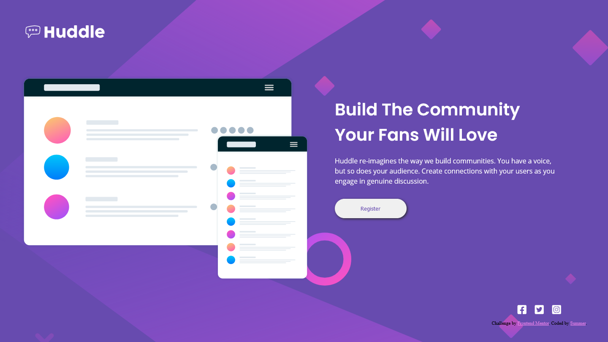

# Frontend Mentor - Huddle landing page with single introductory section solution

This is a solution to the [Huddle landing page with single introductory section challenge on Frontend Mentor](https://www.frontendmentor.io/challenges/huddle-landing-page-with-a-single-introductory-section-B_2Wvxgi0). 

## Table of contents

- [Frontend Mentor - Huddle landing page with single introductory section solution](#frontend-mentor---huddle-landing-page-with-single-introductory-section-solution)
  - [Table of contents](#table-of-contents)
  - [Overview](#overview)
    - [The challenge](#the-challenge)
    - [Links](#links)
    - [Screenshot](#screenshot)
    - [Built with](#built-with)
    - [What I learned](#what-i-learned)


## Overview

### The challenge

Users should be able to:

- View the optimal layout for the page depending on their device's screen size
- See hover states for all interactive elements on the page

### Links

- Solution URL: [Github](https://github.com/summermmg/Huddle-landing-page-with-a-single-introductory-section)
- Live Site URL: [Demo](https://summermmg.github.io/Huddle-landing-page-with-a-single-introductory-section/)
 
### Screenshot
<div align="center"></div>
<div align="center"></div>

### Built with

- Semantic HTML5 markup
- CSS custom properties
- Flexbox
- Mobile-first workflow

### What I learned
* set `flex: 1` to `main` element so that it takes all rest space of the `body`.  
```css
body {
  ...
  display: flex;
  flex-direction: column;
}

main {
  flex: 1;
}
```
* `main` is both a flexbox container itself and a flexbox element of `body` in desktop styles. 
```css
@media screen and (min-width: 1024px) {
  main {
      display: flex;
      max-width: 1440px;
      align-self: center;
  }
}
```